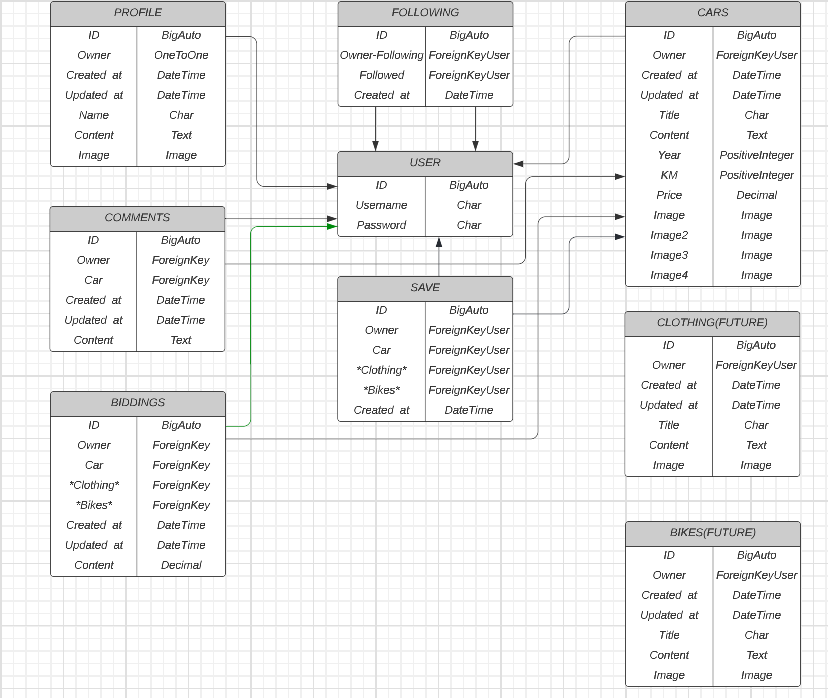

# Carplace Backend
This repository is the backend containing the API using the Django REST Framework for the Carplace frontend application

for the deployed backend click [here](https://backend-pp5.herokuapp.com/)

for the deployed fronted click [here](https://frontend-pp5.herokuapp.com/)

for the frontend repository click [here](https://github.com/MustafaSahinci/pp5-frontend)

## Database

### User Model
- The User model contains information about the user. It is part of the Django allauth library.
- One-to-one relation with the Profile model owner field
- ForeignKey relation with the Following model owner and followed fields
- ForeignKey relation with the Car model owner field
- ForeignKey relation with the Comments model owner field
- ForeignKey relation with the biddings model owner field
- ForeignKey relation with the Save model owner field

### Profile Model
- The Profile model contains the following fields: owner,created_at, updated_at, name, content and image
- One-to-one relation between the owner field and the User model id field

### Following Model
- The Following model contains the following fields: owner, followed and created_at
- ForeignKey relation between the owner field and the User model id field
- ForeignKey relation between the followed field and the User model id field

### Car Model
- The Car model contains the following fields: owner, created_at, updated_at, title, content, year, km, price, image, image2, image3 and image4
- Foreignkey relation between the owner field and the User model id field
- ForeignKey relation with the Comments model car field
- ForeignKey relation with the Biddings model car field
- ForeignKey relation with the Save model car field

### Comments Model
- The Comment model contains the following fields: owner, car, created_at, updated_at and content
- ForeignKey relation between the owner field and the User model id field
- ForeignKey relation between the car field and the Car model owner field

### Biddings Model
- The Biddings model contains the following fields: owner, car, created_at, updated_at and content
- ForeignKey relation between the owner field and the User model id field
- ForeignKey relation between the car field and the Car model owner field

### Save Model
- The Save model contains the following fields: owner, car and created_at
- ForeignKey relation between the owner field and the User model id field
- ForeignKey relation between the car field and the Car model owner field

## test
### admin
admin can do al of these things below for every user
### profile
users can (created automatically), read, update profiles
### following
users can create, read and delete their followings
### car
Users can create, read, update and delete their post(car)
### comments
users can create, read, update and delete their comments
### biddings
users can create, read, update and delete their biddings
### save
users can create, read and delete their saves

## Technologies Used
- Python
- Django rest framework
- cloudinary
- ElephantSQL Used as database for this project
- lucidchart for the database table
- Git used for version control, using the terminal to commit - to Git and Push to GitHub
- GitHub is used to store the projects code after being pushed from Git.
- Gitpod to write my code.
- Heroku used to deploy this app.

## deployments
### Forking the GitHub Repository
1. Go to the GitHub repository
2. Click on Fork button in top right corner
3. You will then have a copy of the repository in your own GitHub account.

### Making a Local Clone
1. Go to the GitHub repository
2. Locate the Code button above the list of files and click it
3. Highlight the "HTTPS" button to clone with HTTPS and copy the link
4. Open commandline interface on your computer
5. Change the current working directory to the one where you want the cloned directory
6. Type git clone and paste the URL from the clipboard

$ git clone https://github.com/MustafaSahinci/pp5-backend.git

7. Press Enter to create your local clone

### Deployment

This project was created on GitHub and Edited in GitPod by carrying out the following:

- A new repository was created
- A meaningful name was given to the new repository and 'Create Repository' was selected
- The repository was then opened on GitHub by clicking - - the 'Gitpod' button to build the GitPod workspace which would allow me to build and edit the code used to make the PROJECT NAME HERE website/application
- Version control was used throughout the project using the following commands in the terminal using Bash
git add . OR git add "file name" - to stage the changes and get them ready for being committed to the local repo.
- git commit -m "Description of the update" - to save the change and commit the change to the local repo
- git push - to push all committed changes to the GitHub repo associated with the GitPod workspace

This project was deployed via Heroku by carrying out the following:

- Create the gitpod repo from the template via the gitpod button in github.
- Log in to Heroku and create a new app.
- Add the heroku-postgres add-on
- Complete the config vars section
- Link Heroku and GitHub accounts together
- Select the repo (via Heroku) that you want to make an app of and give it a name in Heroku.
- Click on deploy.

## Credits
- drf api project from Code Institute
- My mentor Rohit Sharma
- Code institute slack community
- Stackoverflow